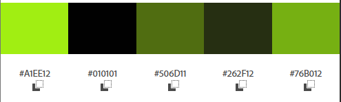

# UniAgenda - Calendário Acadêmico Inteligente 🎓

O **UniAgenda** é um sistema de gestão acadêmica desenvolvido para centralizar o acompanhamento de prazos, entregas de trabalhos e datas de avaliações. O projeto nasceu da necessidade real de organizar múltiplos fluxos de tarefas universitárias, priorizando a visibilidade do "quanto tempo falta" para cada compromisso.

## 🚀 Funcionalidades
- **Dashboard Interativo:** Visão anual e mensal detalhada de 2026.
- **Gestão de Atividades:** Cadastro de provas e trabalhos com campos de descrição para temas de estudo ou membros de grupo.
- **Monitoramento de Prazos:** Painel lateral com contagem de atividades totais, no prazo e vencendo.
- **Calendário de Feriados:** Integração visual de feriados nacionais e facultativos.
- **Navegação Fluida:** Transição entre dashboard geral, visão detalhada mensal e lista de atividades.

## 🎨 Sinalização de Prazos (Cores)
Para facilitar a identificação visual e priorização de tarefas, o sistema utiliza regras de cores baseadas no tempo restante para a entrega:

- **🔴 Alerta Crítico (Vermelho):** Atividades que vencem em **3 dias ou menos**. Essa cor sobrepõe qualquer outra marcação (inclusive feriados) para garantir que o usuário não perca o prazo.
- **⚪ Status Normal (Cinza):** Atividades com prazo superior a 3 dias. Indica um compromisso agendado que ainda não exige atenção imediata.
- **🟢 Dia Atual (Verde):** Destaque com animação para o dia de hoje, facilitando a orientação temporal do usuário.
- **🔵 Feriados e Eventos:** Marcados em azul ou com tags específicas quando não há conflito com prazos críticos.

## 🎨 Identidade Visual
A estética do projeto foi inspirada na cinematografia do filme *"Devoradores de Estrelas - 2026"  (Project Hail Mary - 2026)*. A paleta utiliza um contraste profundo de tons verdes e acentos vibrantes, criando uma interface imersiva e moderna.
##

## 🛠️ Tecnologias Utilizadas
- **HTML5:** Estrutura semântica.
- **CSS3:** Variáveis CSS, Flexbox e Grid.
- **JavaScript :** Lógica de datas, cálculos de prazos e `localStorage`.

## 📂 Estrutura de Telas
1. **Login (`index.html`):** Portal de acesso.
2. **Dashboard (`dashboard.html`):** Visão central do ano e resumo de métricas.
3. **Gerenciador de Atividades (`atividades.html`):** Lista detalhada e controle de status.

## Como acessar ? 
Neste prototipo ainda não tem uma autenticação de login verdadeira então para acessar o site basta:  
Login: Qualquer email que você tenha.
Senha: Qualquer senha. 
